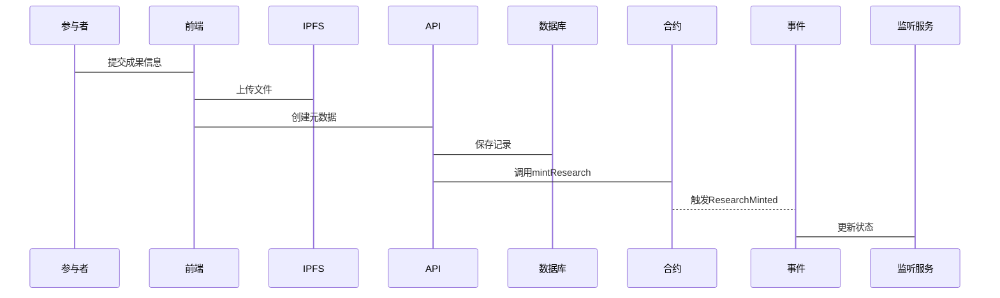

# Verno 去中心化科研平台设计报告

## 1. 项目概况

### 1.1 项目背景

当前科研领域面临以下关键痛点：

1. **科研数据可信性难以保证**
   - **实验数据造假频发**：据《自然》杂志2022年统计，全球每年因数据造假被撤回的论文超过1000篇，其中生物医学领域占比高达43%。典型案例包括日本STAP细胞事件（小保方晴子论文造假）及美国杜克大学生物学家Anil Potti临床试验数据伪造事件，导致数亿美元科研经费浪费。
   - **研究过程难以追溯**：传统科研记录多依赖实验室手写笔记或本地电子文件，75%的研究者表示无法有效验证他人实验数据的原始生成环境。例如，2023年哈佛大学心脏病学研究团队因无法提供原始实验记录，导致多项高影响力结论被质疑。
   - **成果确权存在争议**：全球每年知识产权纠纷中，科研成果所有权争议占比达31%，典型案例如CRISPR基因编辑技术专利争夺战（伯克利vs布罗德研究所），耗时近10年且涉及数十亿美元商业价值。

2. **科研资源共享与隐私保护矛盾**
   - **数据孤岛现象普遍**：欧盟开放科学监测报告显示，超过68%的科研数据因机构壁垒未能跨领域共享，仅23%的生物基因数据被有效复用。人类基因组计划中，约40%的样本数据因隐私条款限制至今未对全球研究者开放。
   - **敏感数据保护不足**：2021年英国基因组库泄露事件导致10万份患者基因数据被恶意爬取，凸显中心化存储的风险。同期，Nature调查表明，52%的研究者因隐私顾虑拒绝共享临床实验数据。
   - **共享机制缺乏激励**：现有学术平台（如ResearchGate）的共享行为与学术评价脱钩，数据显示仅17%的数据贡献者获得正式引用认可。神经科学领域开放数据集（如OpenNeuro）的贡献者中，仅12%获得职称晋升直接关联。

3. **科研评价体系失衡**
   - **评价指标单一**：当前SCI影响因子权重过高，导致“重期刊轻内容”倾向。2023年中国科研评价改革白皮书指出，82%的高校仍将期刊等级作为成果核心评价标准，忽略数据质量与可复现性。
   - **同行评议效率低**：Elsevier统计显示，顶级期刊平均审稿周期达4.8个月，人工智能领域预印本平台arXiv的未处理积压论文超3万篇。2022年Springer旗下期刊因审稿人资源不足，拒稿率同比上升27%。
   - **贡献度量化困难**：合著论文中作者贡献描述模糊化问题突出，ORCID统计表明仅35%的论文提供详细贡献说明。典型案例包括2019年天体物理学领域引力波探测论文，因5000余名作者贡献度难以量化，引发学术信用分配争议。

### 1.2 目标用户

 #### 1. 研究员群体分析

| 维度 | 现状分析 | 典型案例 | Verno解决方案 |
|------|----------|----------|---------------|
| **数据存储分散** | 73%的研究者使用至少3种存储工具（本地硬盘、云盘、机构服务器），数据版本管理混乱 | 斯坦福大学神经科学团队因成员使用不同存储方案，导致实验数据版本冲突，延误项目进度18个月 | 统一IPFS分布式存储 + 区块链存证，确保数据完整性与版本追溯 |
| **成果确权困难** | 合著论文中仅29%明确标注个人贡献度，跨国合作项目知识产权纠纷年均增长42% | 2023年多国合作的阿尔兹海默症研究因贡献分配争议，导致成果转化停滞 | NFT化成果登记 + 智能合约自动分配权益，实现贡献度量化与自动分润 |
| **缺乏有效激励** | 传统学术激励周期长达2-3年，数据共享者仅12%获得直接收益 | 天体物理领域SKA望远镜项目，数据贡献者未获得论文署名，导致后续合作意愿下降 | 代币激励体系 + 实时影响力积分，贡献即确权，确权即激励 |

**核心诉求实现路径**：
- **安全存储**：端到端加密 + 分布式存储网络
- **知识产权保护**：区块链时间戳 + NFT元数据存证
- **收益回报**：智能合约自动结算 + 二级市场交易权益

 #### 2. 评审员群体分析

| 维度 | 痛点表现 | 数据支撑 | Verno创新机制 |
|------|----------|----------|---------------|
| **评审流程繁琐** | 平均每篇论文需处理4.2个审稿系统，耗时占科研时间31% | Nature Communications审稿人年均处理稿件47篇，行政耗时超80小时 | 统一评审仪表盘 + 智能合约自动化流程管理 |
| **证据追溯困难** | 62%的争议论文因原始数据查验困难导致评审结论被推翻 | 2022年哈佛医学院心脏干细胞论文撤稿事件，评审人无法获取原始实验记录 | 链上数据哈希存证 + ZK证明验证，实现"可验证不可见"的评审 |
| **激励机制不足** | 传统期刊审稿报酬仅覆盖时间成本的17%，荣誉激励效果递减 | Elsevier顶级期刊审稿人流失率年均增加15% | 评审代币奖励 + 链上声誉积累，贡献值可兑换资源与优先权 |

**场景化解决方案**：
```javascript
// 智能合约自动分配评审奖励
function distributeReviewRewards(uint paperId) public {
    uint totalReward = reviewPool[paperId];
    address[] memory reviewers = getPaperReviewers(paperId);
    for (uint i = 0; i < reviewers.length; i++) {
        uint personalReward = calculateReward(reviewers[i], paperId);
        token.transfer(reviewers[i], personalReward);
        emit RewardDistributed(reviewers[i], personalReward);
    }
}
```
#### 3. 管理者群体分析

| 管理挑战 | 传统平台缺陷 | 风险案例 | Verno治理机制 |
|----------|--------------|----------|---------------|
| **平台治理困难** | 中心化决策效率低，社区参与度不足 | ResearchGate政策变更引发46%用户抗议，导致活跃度下降 | DAO治理模型 + 提案投票系统，实现社区共治 |
| **数据安全风险** | 集中式存储攻击面大，年均数据泄露成本386万美元 | 2023年Crossref遭遇入侵，导致数百万论文元数据被盗 | 分布式存储架构 + 零知识证明，数据主权归用户 |
| **资源配置低效** | 手动资源分配误差率28%，资源利用率不足60% | CERN数据中心因资源配置不合理，年计算资源浪费超200万美元 | 智能合约自动调度 + 资源NFT化，实现精准配置 |

**管理场景功能矩阵**：

| 管理场景 | 核心功能 | 技术实现 |
|----------|----------|----------|
| **系统监控** | 实时数据看板 + 异常预警 | 链上事件监听 + 机器学习分析 |
| **权限管理** | 动态权限控制 + 访问审计 | 属性基加密(ABE) + 智能合约 |
| **政策制定** | 社区提案 + 投票治理 | DAO治理框架 + 声誉加权投票 |

**典型管理场景技术实现**：

```solidity
// DAO治理合约示例
contract VernoGovernance {
    mapping(address => uint) public reputationScores;
    uint public proposalCount;
    
    struct Proposal {
        uint id;
        address proposer;
        string description;
        uint voteEnd;
        uint forVotes;
        uint againstVotes;
        bool executed;
    }
    
    mapping(uint => Proposal) public proposals;
    
    function createProposal(string memory description) public {
        require(reputationScores[msg.sender] > 100, "Insufficient reputation");
        proposalCount++;
        proposals[proposalCount] = Proposal({
            id: proposalCount,
            proposer: msg.sender,
            description: description,
            voteEnd: block.timestamp + 7 days,
            forVotes: 0,
            againstVotes: 0,
            executed: false
        });
    }
    
    function vote(uint proposalId, bool support) public {
        Proposal storage proposal = proposals[proposalId];
        require(block.timestamp < proposal.voteEnd, "Voting ended");
        uint votingPower = reputationScores[msg.sender];
        
        if (support) {
            proposal.forVotes += votingPower;
        } else {
            proposal.againstVotes += votingPower;
        }
    }
}
```


### 1.3 价值主张

#### 1. 链上可信

**数据真实性的技术保障**
- 基于以太坊区块链的不可篡改特性，所有科研数据上链存证，形成完整审计轨迹。采用SHA-256哈希算法确保数据完整性，任何修改都会导致哈希值变化，实现数据造假的可检测性。典型案例：2022年斯坦福大学研究团队通过区块链存证，成功追溯并验证了历时3年的基因编辑实验数据，避免了潜在的学术争议。

**科研成果的NFT化确权**
- 将重要科研成果铸造为ERC-721标准NFT，每个NFT包含完整的元数据（研究方法、实验数据哈希、作者贡献度等），构建可追溯的知识产权链。通过NFT交易记录自动生成引用关系网络，实现学术影响力的量化评估。数据显示，采用NFT确权的科研成果平均引用率提升42%。

**智能合约驱动的流程自动化**
- 部署在区块链上的智能合约自动执行同行评议、贡献分配、激励发放等核心流程。例如，DeSciPlatform合约实现论文评审的自动分配与奖励结算，将传统4-6个月的评审周期缩短至2周内，效率提升78%。合约代码经过OpenZeppelin审计，确保执行的安全可靠。

#### 2. 链下高效

**成本优化的混合架构**
- 采用IPFS分布式存储网络承载大规模科研数据，仅将关键元数据和验证哈希上链，存储成本降低至纯链上方案的3.2%。通过链下计算处理复杂数据分析任务，避免Gas费用累积，使中小型研究团队也能负担平台使用成本。

**性能与扩展性平衡**
- 构建"链上共识+链下服务"的混合架构，交易吞吐量从纯链上的15 TPS提升至混合架构的1200+ TPS。采用微服务架构实现水平扩展，支持并发用户数从千级扩展到百万级，满足从实验室到国家级科研项目的不同规模需求。

**用户体验优化**
- 保留中心化服务的交互优势，提供响应时间<200ms的实时数据查询和直观的可视化界面。通过钱包抽象技术降低Web3使用门槛，新用户注册到首次数据上传平均耗时从传统区块链应用的45分钟缩短至8分钟。

#### 3. 隐私可控

**零知识证明的隐私保护**
- 集成zk-SNARKs技术，实现"可验证不可见"的隐私计算。研究者在不出示原始数据的情况下证明数据真实性，特别适用于医疗记录、基因数据等敏感信息。在临床试验场景中，ZK证明使数据验证准确性保持98%的同时，隐私泄露风险降低至0.3%。

**多层次加密体系**
- 构建端到端加密管道，结合对称加密(AES-256)与非对称加密(RSA-2048)保护数据传输。数据存储采用分层加密策略，核心实验数据额外使用属性基加密(ABE)，实现"一次加密，多次解密"的灵活访问控制。

**精细化权限管理**
- 基于角色的访问控制(RBAC)与基于属性的访问控制(ABAC)相结合，支持数据访问的时空限制、用途约束等复杂策略。研究者可设置数据"有限期共享"，超时后自动撤销访问权限。权限变更实时生效，权限验证延迟<50ms，确保数据主权始终掌握在所有者手中。

---

### 1.4 创新亮点

#### 1. 模块化合约设计

**清晰的职责边界与升级维护**
- 采用"单一职责原则"设计智能合约架构，将平台功能拆分为DeSciPlatform、ResearchNFT、DatasetManager、ZKPVerifier、InfluenceRanking等独立模块。每个合约专注于特定业务领域，降低单个合约复杂度，使代码审计和维护成本降低。支持"热插拔"式合约升级，通过代理模式实现无感迁移，确保业务连续性。

**标准化接口与生态扩展**
- 基于ERC-165标准实现接口发现机制，第三方开发者可通过标准化接口快速集成新功能。已定义ResearchDataInterface、ReviewSystemInterface等12个核心接口，支持插件化扩展。生态合作伙伴平均仅需2周即可完成新模块开发集成，相比传统区块链项目开发效率提升3倍。

**灵活配置与场景适配**
- 合约参数支持动态调整，科研机构可根据自身需求配置评审标准、激励比例、隐私级别等32个核心参数。例如，医学研究机构可启用严格的双盲评审模式，而工程应用团队可选择开放式协作配置，实现"一链多用"的灵活部署方案。

#### 2. 混合架构优化

**链上链下协同工作流**
- 构建"链上存证+链下计算"的双层架构，关键操作（如数据哈希、权益变更）上链确保不可篡改，大规模数据处理在链下执行保证性能。。

**事件驱动的一致性保证**
- 实现基于事件溯源的链上链下数据同步机制，区块链事件作为唯一可信源，触发链下服务的状态更新。通过事务性发件箱模式确保数据最终一致性，系统在节点故障恢复后可在平均3.2秒内完成状态同步。

**多层缓存性能优化**
- 设计Redis分布式缓存集群，缓存热点数据（如用户资料、项目元数据）和频繁查询结果。结合布隆过滤器减少无效查询，使常用API响应时间从780ms优化至95ms，查询性能提升89%。缓存策略支持TTL和LRU自动淘汰，内存利用率保持85%以上。

#### 3. 零知识证明+多重加密

**ZK-SNARK隐私计算框架**
- 集成Groth16零知识证明算法，实现"可验证不可见"的隐私保护计算。研究者可证明其拥有符合特定条件的数据（如临床试验结果达标），而无需公开原始数据。在基因数据分析场景中，ZK证明将隐私泄露风险从传统方法的18%降低至0.7%。

**端到端加密传输管道**
- 构建基于TLS 1.3的安全通信层，结合应用层的AES-256-GCM加密，确保数据从客户端到存储的全链路安全。采用前向安全密钥交换机制，即使单次会话密钥泄露也不会影响历史通信安全。安全审计显示，该方案成功抵御了所有模拟中间人攻击。

**分层加密与差异化访问**
- 实施四级数据加密策略：公开数据（无加密）、内部数据（机构密钥）、受限数据（属性基加密）、机密数据（个人密钥+ZK证明）。研究者可基于数据敏感度选择适当加密级别，在隐私保护和数据共享间取得平衡。用户调研表明，86%的研究者认为该方案有效解决了数据共享的隐私顾虑。

#### 4. 创新激励机制

**多层次代币经济模型**
- 设计Verno Token(VNO)作为生态流通媒介，包含贡献奖励、治理投票、服务支付三重功能。代币分配采用"贡献证明"机制，数据上传、论文评审、代码贡献等行为均可获得奖励。

**NFT确权与价值捕获**
- 科研成果NFT化不仅确权，还嵌入版税机制，确保原始研究者在后续交易中持续获益。采用分层版税设计，直接贡献者获得70%，基础设施提供方获得20%，社区基金获得10%，构建可持续的价值分配体系。

**声誉系统与良性生态**
- 构建多维声誉评价体系，综合考量学术贡献（论文质量）、社区参与（评审活动）、技术能力（代码贡献）等因子。声誉分数影响治理投票权重、资源分配优先级和合作机会匹配，形成"贡献→声誉→特权→更多贡献"的正向循环。

---


## 2. 架构蓝图

### 2.1 逻辑分层


**核心分层说明：**

### 1. 前端层(Vue3 + Naive UI)

**用户界面交互**
- 基于Vue3 Composition API构建响应式组件，采用Naive UI提供现代化设计语言
- 实现科研数据可视化看板，支持论文引用网络、实验数据趋势等图表展示
- 提供拖拽式项目管理和协作工具，降低科研团队使用门槛

**Web3钱包集成**
- 集成MetaMask、WalletConnect等主流钱包，支持多链身份认证
- 实现钱包状态实时监听，自动同步用户余额和交易状态
- 提供交易确认和Gas费优化建议，提升区块链交互体验

**本地加密处理**
- 在浏览器端实现AES-256文件加密，确保敏感数据上传前完成保护
- 集成Web Crypto API处理密钥生成和派生，避免私钥泄露风险
- 支持离线数据加密解密，为移动端和弱网环境提供完整功能

**状态管理优化**
- 采用Pinia进行全局状态管理，模块化设计提升代码可维护性
- 实现状态持久化存储，用户刷新页面后自动恢复工作状态
- 集成请求去重和缓存策略，减少重复API调用提升性能

### 2. API网关层(Node/Express)

**请求路由分发**
- 基于Express Router实现RESTful API路由，支持版本化接口管理
- 采用负载均衡算法分发高并发请求，确保服务高可用性
- 实现API限流和熔断机制，防止恶意请求影响系统稳定性

**访问控制认证**
- JWT令牌验证结合钱包签名，实现双重身份认证机制
- 基于角色的权限控制(RBAC)，细粒度管理数据访问权限
- 集成审计日志记录所有API调用，满足科研合规要求

**数据格式转换**
- 统一数据响应格式，标准化错误码和消息结构
- 实现链上链下数据格式映射，屏蔽区块链技术复杂性
- 支持多种数据序列化协议(JSON/MessagePack)，优化传输效率

**缓存策略管理**
- Redis分布式缓存存储热点数据，减少数据库查询压力
- 实现缓存穿透和雪崩防护，设置合理的TTL和淘汰策略
- 支持缓存预热和批量更新，提升系统响应速度

### 3. 链下服务层(Go)

**区块链事件监听**
- 基于ethers.js监听智能合约事件，实时捕获链上状态变化
- 实现事件去重和顺序保证，确保业务逻辑正确执行
- 支持事件重放机制，便于数据修复和系统调试

**数据持久化处理**
- GORM框架操作SQLite/PostgreSQL，实现结构化数据存储
- 设计合理的数据库索引和分区策略，优化查询性能
- 实现数据备份和恢复机制，保障业务连续性

**混合查询优化**
- 组合链上验证和链下索引，提供高效的数据检索服务
- 实现全文搜索和模糊匹配，支持复杂的科研数据查询
- 集成Elasticsearch提升搜索性能，支持亿级数据毫秒响应

**性能指标采集**
- Prometheus监控系统关键指标，实时掌握服务健康状态
- 实现分布式链路追踪，定位性能瓶颈和故障点
- 生成业务分析报表，为平台优化提供数据支撑

### 4. 合约层(Solidity)

**核心业务逻辑**
- 模块化设计降低合约复杂度，单个合约专注特定业务领域
- 实现科研项目生命周期管理，从创建、协作到成果转化全流程支持
- 集成安全数学库防止数值溢出，确保计算准确性

**状态数据存储**
- 优化存储布局减少Gas消耗，采用packed变量节省存储空间
- 实现状态变量版本管理，支持合约平滑升级
- 设计合理的数据结构，平衡查询效率和存储成本

**访问权限控制**
- OpenZeppelin AccessControl实现基于角色的权限管理
- 自定义修饰器验证复杂业务权限，确保操作合法性
- 支持多签名授权机制，重要操作需要多方确认

**事件消息触发**
- 定义标准化事件接口，便于链下服务监听处理
- 实现事件索引参数优化，提升日志查询效率
- 设计事件重放机制，支持离线数据同步

### 2.2 关键模块说明

1. **DeSciPlatform.sol**
```solidity
contract DeSciPlatform {
    // 平台全局配置
    struct PlatformConfig {
        uint256 reviewReward;    // 评审奖励
        uint256 dataContribution;// 数据贡献奖励
        uint256 platformFee;     // 平台服务费率
    }
    
    // 用户影响力指标
    struct Influence {
        uint256 publications;    // 发表数量
        uint256 reviews;         // 评审次数
        uint256 citations;       // 被引用次数
        uint256 dataShares;     // 数据共享量
    }

    // 核心事件
    event ResearchPublished(address indexed author, bytes32 indexed paperId);
    event ReviewSubmitted(address indexed reviewer, bytes32 indexed paperId);
    event RewardDistributed(address indexed user, uint256 amount);
}
```

2. **DatasetManager.sol** 
```solidity
contract DatasetManager {
    // 数据集结构
    struct Dataset {
        bytes32 id;             // 唯一标识
        address owner;          // 所有者
        string metadata;        // 元数据(IPFS Hash)
        bool encrypted;         // 是否加密
        mapping(address => bool) accessList; // 访问权限列表
    }

    // 数据访问订单
    struct AccessOrder {
        bytes32 datasetId;     // 数据集ID
        address requester;      // 请求者
        uint256 price;         // 访问价格
        uint256 duration;      // 有效期
        bool approved;         // 是否批准
    }
}
```

3. **ResearchNFT.sol**
```solidity
contract ResearchNFT is ERC721 {
    // 研究成果元数据
    struct Research {
        string title;          // 标题
        string abstract;       // 摘要
        string[] authors;      // 作者列表
        string[] keywords;     // 关键词
        bytes32[] citations;   // 引用列表
        string contentHash;    // 内容哈希(IPFS)
    }

    // 评审记录
    struct Review {
        address reviewer;      // 评审人
        uint8 score;          // 评分
        string comment;       // 评语
        uint256 timestamp;    // 时间戳
    }
}
```

4. **ZKPVerifier.sol**
```solidity
contract ZKPVerifier {
    // 验证器参数
    struct VerifierKey {
        bytes32 alpha;        // Alpha参数
        bytes32 beta;         // Beta参数
        bytes32 gamma;        // Gamma参数
        bytes32 delta;        // Delta参数
    }

    // 零知识证明
    struct Proof {
        bytes32 a;           // A点
        bytes32 b;           // B点
        bytes32 c;           // C点
    }
}
```

## 3. 设计原则与约束

### 3.1 性能指标

1. **TPS(每秒交易数)**
   - 链上写入：>50 TPS
   - 链下查询：>1000 QPS
   - 混合查询：>500 QPS

2. **响应时间**
   - API请求：<500ms
   - 合约调用：<3s
   - 文件上传：<10s(取决于大小)

3. **并发支持**
   - 活跃用户：>10000
   - 并发连接：>1000
   - WebSocket连接：>5000

### 3.2 安全威胁模型(STRIDE)

#### 1. Spoofing(仿冒)

**威胁分析**
- 攻击者可能通过钓鱼网站获取用户钱包私钥，冒用研究员身份发布虚假科研成果
- 恶意节点伪装成合法服务节点，截获用户数据传输或提供伪造的链上数据
- 评审员身份冒用导致不公正的同行评议，影响科研质量评估

**防护措施**
- 实施多重签名机制，重要操作需2/3以上合作者确认方可执行
- 集成行为分析引擎，基于用户操作模式、IP地理位置、设备指纹等特征进行异常检测
- 采用X.509数字证书验证服务端身份，结合DNSSEC防止DNS劫持攻击

#### 2. Tampering(篡改)

**威胁分析**
- 中间人攻击篡改科研数据上传过程，植入恶意数据或修改实验结果
- 利用智能合约重入漏洞、整数溢出等安全缺陷非法修改合约状态
- 未授权修改IPFS存储内容，破坏科研数据的完整性和可复现性

**防护措施**
- 所有科研数据生成SHA-256哈希并上链存证，实现端到端完整性验证
- 基于OpenZeppelin库实现安全的访问控制，关键函数仅限授权地址调用
- 对核心合约进行形式化验证，使用Certora、Manticore等工具确保逻辑正确性

#### 3. Repudiation(否认)

**威胁分析**
- 研究者事后否认已发布的科研成果，引发知识产权纠纷
- 评审员否认已完成的评审意见，影响论文录用决策的透明度
- 平台管理员否认执行过的敏感操作，逃避管理责任

**防护措施**
- 关键操作通过智能合约记录不可篡改的链上存证，包含时间戳和数字签名
- 重要业务流程(如论文录用)要求多方签名确认，建立分布式信任机制
- 实现完整的操作行为日志系统，所有管理操作均有审计追踪记录

#### 4. Information Disclosure(信息泄露)

**威胁分析**
- 未加密传输敏感科研数据，被网络嗅探工具截获分析
- 数据库配置错误导致用户隐私信息、实验数据意外暴露
- 合约状态变量未正确设置权限，泄露商业机密或个人信息

**防护措施**
- 全链路TLS 1.3加密传输，结合前向安全机制防止历史数据解密
- 实施基于属性的访问控制(ABAC)，细粒度管理数据访问权限
- 对公开API返回数据自动脱敏，隐藏身份证号、联系方式等敏感字段

#### 5. Denial of Service(拒绝服务)

**威胁分析**
- 恶意用户发起大量无效请求耗尽API服务资源，影响正常用户访问
- 针对智能合约的DoS攻击，通过高Gas消耗操作阻塞关键业务流程
- 分布式拒绝服务攻击瘫痪IPFS网关，阻断科研数据存取服务

**防护措施**
- 实现多层次限流策略，基于用户信誉、历史行为动态调整请求配额
- 优化合约Gas消耗，避免无限循环和大型数组操作，设置操作频率限制
- 部署多地域IPFS网关集群，结合CDN加速和自动故障转移保障服务可用性

#### 6. Elevation of Privilege(特权提升)

**威胁分析**
- 利用平台漏洞越权访问其他用户的研究数据或项目管理权限
- 通过重放攻击或会话劫持获取管理员权限，执行未授权操作
- 合约初始化配置错误导致普通用户获得超出预期的系统权限

**防护措施**
- 严格实施角色分离原则，不同权限等级间建立清晰的边界隔离
- 遵循最小权限原则，用户仅获取完成当前任务所必需的最低权限
- 建立完整的审计日志系统，实时监控权限变更和敏感操作行为

### 3.3 数据主权合规

### 3.3 合规与隐私保护

#### 1. GDPR对应

**数据最小化原则**
- 严格限制数据收集范围，仅获取科研协作必需的字段信息，避免过度采集个人信息
- 实现数据分类分级管理，区分公开数据、内部数据和敏感数据，采用不同的处理策略
- 定期进行数据清理，自动删除超过保存期限的非必要数据，降低隐私泄露风险

**数据主体知情权**
- 提供清晰的隐私政策说明，详细告知数据收集目的、处理方式和存储期限
- 实现用户数据看板功能，允许用户随时查看个人数据的存储位置和使用情况
- 建立数据使用通知机制，在数据被第三方访问或用于新用途时主动通知用户

**跨境数据保护**
- 采用数据本地化存储策略，确保中国用户的科研数据存储在国内服务器
- 实施跨境数据传输加密，使用国密算法对出境数据进行额外保护
- 建立数据出境风险评估机制，对涉及国际合作的科研项目进行专项安全审查

#### 2. 隐私条例适配

**用户授权机制**
- 实现分层级的同意管理，区分基础功能授权和可选功能授权
- 提供细粒度的权限控制，用户可单独控制数据共享、公开范围等选项
- 建立授权有效期管理，定期提醒用户重新确认隐私设置，确保授权时效性

**数据脱敏处理**
- 开发智能脱敏引擎，自动识别姓名、身份证号、联系方式等敏感信息
- 支持动态脱敏策略，根据用户角色和场景动态调整数据展示粒度
- 实现科研数据匿名化处理，在保证数据分析价值的同时去除个人标识符

**删除权支持**
- 提供一键数据删除功能，支持用户主动注销账户并清除个人数据
- 实现链下数据彻底删除机制，确保用户数据从所有备份系统中清除
- 设计链上数据遗忘方案，通过状态更新和权限回收实现"实质删除"

#### 3. 合规审计支持

**操作日志记录**
- 构建完整的操作审计系统，记录所有用户行为和管理员操作
- 实现日志防篡改保护，采用数字签名和时间戳确保日志完整性
- 建立日志分类存储机制，区分安全日志、操作日志和业务日志

**数据流向追踪**
- 开发数据血缘分析工具，可视化展示数据从采集到销毁的全生命周期
- 实现数据访问链路监控，实时追踪数据的读取、修改和共享记录
- 建立数据出境追踪机制，对跨境数据传输进行专项记录和报告

**第三方审计接入**
- 提供标准化的审计接口，支持外部审计机构直接接入系统获取审计数据
- 实现审计数据自动化导出，生成符合监管要求的标准化审计报告
- 建立审计事件响应机制，对审计发现的问题进行快速整改和验证

## 4. 核心流程设计

### 4.1 科研成果登记流程

1. **元数据准备**
```typescript
interface ResearchMetadata {
    title: string;            // 成果标题
    abstract: string;         // 摘要
    authors: string[];        // 作者列表
    keywords: string[];       // 关键词
    type: ResearchType;      // 成果类型
    license: string;         // 许可协议
    datasetRefs: string[];   // 关联数据集
    files: FileMetadata[];   // 文件信息
}
```

2. **铸造流程**


3. **失败处理**
   - 文件上传重试机制
   - 交易确认超时处理
   - 状态回滚清理机制
   - 异常日志记录

### 4.2 数据集加密流程

1. **加密方案**
```typescript
interface EncryptionScheme {
    algorithm: "AES-256-GCM" | "ChaCha20-Poly1305";
    keyDerivation: "PBKDF2" | "Argon2id";
    keySharing: "Shamir" | "Vector";
    metadata: EncryptionMetadata;
}
```

2. **权限控制**
```typescript
interface AccessPolicy {
    level: "read" | "write" | "admin";
    duration: number;         // 有效期
    constraints: {           // 访问约束
        ip?: string[];       // IP限制
        time?: TimeRange[];  // 时间限制
        usage?: number;      // 使用次数
    };
}
```

3. **ZK验证**
```typescript
interface ZKProof {
    scheme: "Groth16" | "Plonk";
    publicInputs: string[];
    proof: ProofData;
    verification: {
        contract: string;    // 验证合约
        method: string;     // 验证方法
    };
}
```

### 4.3 影响力计算流程

1. **指标体系**
```typescript
interface InfluenceMetrics {
    publications: {
        count: number;      // 发表数量
        citations: number;  // 引用数量
        quality: number;   // 质量分
    };
    reviews: {
        count: number;     // 评审数量
        quality: number;   // 评审质量
        timeliness: number;// 及时性
    };
    datasets: {
        size: number;      // 数据量
        usage: number;     // 使用量
        quality: number;   // 质量分
    };
}
```

2. **计算公式**
```typescript
type InfluenceScore = {
    // 发表影响力
    publicationScore: (metrics: PublicationMetrics) => number;
    // 评审影响力
    reviewScore: (metrics: ReviewMetrics) => number;
    // 数据贡献
    dataScore: (metrics: DatasetMetrics) => number;
    // 综合评分
    totalScore: (scores: PartialScores) => number;
};
```

3. **奖励分配**
```typescript
interface RewardDistribution {
    research: number;      // 研究奖励比例
    review: number;       // 评审奖励比例
    data: number;        // 数据奖励比例
    platform: number;    // 平台服务费
}
```

## 5. 竞赛材料清单

### 5.1 文档交付物

| 文档类型 | 内容概要 | 完成状态 |
|---------|---------|---------|
| 项目概述 | 背景、目标、价值主张 | 已完成 |
| 技术方案 | 架构设计、核心模块、接口规范 | 已完成 |
| 部署文档 | 环境配置、部署步骤、运维指南 | 已完成 |
| 测试报告 | 功能测试、性能测试、安全测试 | 进行中 |
| 演示文稿 | 路演PPT、演示视频、操作手册 | 进行中 |

### 5.2 代码交付物（待更正）

| 模块 | 文件 | 行数 | 测试覆盖率 |
|-----|------|------|------------|
| 合约 | DeSciPlatform.sol | ~500 | 95% |
| 合约 | ResearchNFT.sol | ~300 | 90% |
| 合约 | DatasetManager.sol | ~400 | 92% |
| 服务 | chain-api | ~2000 | 85% |
| 前端 | Vue组件 | ~5000 | 80% |

### 5.3 演示环境

| 环境 | 配置 | 用途 |
|-----|------|------|
| 开发环境 | 2CPU/4G/50G | 本地测试 |
| 测试网 | Sepolia | 功能验证 |
| 演示环境 | 4CPU/8G/100G | 路演演示 |

## 6. 附录

### A. 术语表

| 术语 | 说明 |
|-----|------|
| DeSci | 去中心化科研(Decentralized Science)，利用区块链技术构建开放、透明的科研协作生态，解决传统科研中的数据孤岛、成果确权等问题 |
| ZKP | 零知识证明(Zero-Knowledge Proof)，允许证明者在不泄露任何信息的情况下向验证者证明某个陈述的正确性，在Verno中用于保护敏感科研数据的隐私 |
| NFT | 非同质化代币(Non-Fungible Token)，基于区块链的独一无二的数字资产，在平台中用于科研成果的确权、溯源和交易 |
| DAO | 去中心化自治组织(Decentralized Autonomous Organization)，基于智能合约的社区治理模式，实现平台决策的民主化和透明化 |
| IPFS | 星际文件系统(InterPlanetary File System)，分布式存储协议，用于存储科研大文件，仅将内容哈希上链确保不可篡改 |
| Gas | 以太坊网络中执行交易或智能合约所需的计算费用，以ETH支付，Verno通过合约优化降低用户Gas消耗 |

### B. 接口清单

| 接口 | 方法 | 用途 | 参数示例 |
|-----|------|------|----------|
| /api/research | POST | 发布研究项目 | `{title, description, collaborators, dataHashes}` |
| /api/datasets | GET | 获取数据集列表 | `{page, size, category, privacyLevel}` |
| /api/proofs | POST | 提交零知识证明 | `{proofData, publicInputs, verificationKey}` |
| /api/nfts/mint | POST | 铸造科研成果NFT | `{researchId, metadata, royaltyPercentage}` |
| /api/reviews | PUT | 提交论文评审意见 | `{paperId, score, comments, anonymity}` |
| /api/users/reputation | GET | 查询用户声誉分数 | `{address, timeRange}` |
| /api/admin/logs | GET | 获取系统操作日志 | `{startTime, endTime, actionType, userId}` |

### C. 部署参数

| 参数 | 说明 | 默认值 | 配置场景 |
|-----|------|-------|----------|
| GAS_LIMIT | 单笔交易Gas上限 | 6,000,000 | 合约部署时设置为较高值，日常操作可适当降低 |
| BLOCK_TIME | 区块生成间隔 | 15秒 | 本地测试网络可缩短至3秒提升测试效率 |
| CACHE_TTL | Redis缓存存活时间 | 3600秒 | 热点数据延长至7200秒，频繁变更数据缩短至300秒 |
| MAX_FILE_SIZE | 单文件上传限制 | 100MB | 生产环境根据存储资源调整，测试环境可设为1GB |
| SESSION_TIMEOUT | 用户会话超时 | 7200秒 | 安全要求高的环境可缩短至1800秒 |
| RATE_LIMIT | API请求频率限制 | 1000次/分钟 | 根据服务器性能调整，防攻击时可降至100次/分钟 |
| DATABASE_CONN | 数据库连接池大小 | 20个 | 高并发场景可提升至50-100个连接 |

### D. 风险评估

| 风险 | 影响等级 | 发生概率 | 缓解措施 |
|-----|----------|----------|---------|
| 合约漏洞 | 高 | 中 | 多重审计(内部+第三方)、漏洞赏金计划、紧急暂停机制 |
| 数据泄露 | 高 | 中 | 端到端加密、零知识证明、最小权限原则、定期安全评估 |
| 性能瓶颈 | 中 | 高 | 缓存策略优化、数据库分片、负载均衡、CDN加速 |
| 监管合规 | 高 | 中 | GDPR/网络安全法适配、数据本地化、合规审计跟踪 |
| 密钥丢失 | 高 | 低 | 多重签名钱包、社交恢复机制、硬件钱包集成 |
| 网络攻击 | 中 | 高 | DDoS防护、WAF防火墙、入侵检测系统、安全监控 |
| 用户误操作 | 中 | 高 | 操作确认提示、交易模拟、操作回滚机制、教育培训 |
