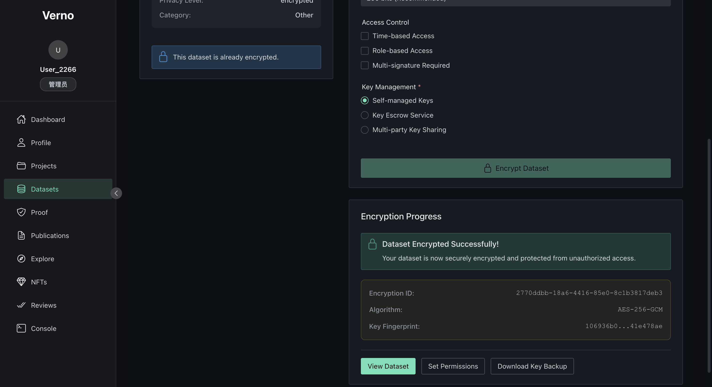

# Verno 去中心化科研平台 · 测试文档

## 1. 测试目标与范围

| 目标 | 说明 | 关联文档/脚本 |
| --- | --- | --- |
| 核心能力回归 | 确保合约、链下服务、API 可用 | `tests/verno-complete-tests/COMPLETE_TEST_REPORT.md` |
| 前端真实场景 | 覆盖用户主流程（身份 → 项目 → 数据 → ZK → NFT → 验证） | 本框架第 3 节 |
| 性能与稳定性 | 关键接口的响应时间、并发能力 | `tests/verno-complete-tests/run_complete_tests.sh` |
| 安全与隐私 | 权限、审计、ZK 校验 | 合约/后端代码审阅 |


---

## 2. 自动化基线

### 2.1 Complete Test Suite 概览

- 目录：`tests/verno-complete-tests`
- 关键产物：
  - `COMPLETE_TEST_REPORT.md`：最新一次全量测试报告（示例结论：前端页面、Go API、合约结构检查全部通过）。
  - `run_complete_tests.sh`：执行入口脚本，自动收集页面可达性、API 状态、数据库一致性等。
  - `test_verno_complete.py`：基于 Pytest 的具体检查逻辑。
  - `test_config.json`：可扩展的测试目标配置。
- 推荐流程：
  ```bash
  cd tests/verno-complete-tests
  ./run_complete_tests.sh            # 触发全量测试
  cat COMPLETE_TEST_REPORT.md        # 查看自动生成报告
  ```

> 若脚本输出 WARN/FAIL，请在本框架第 4 节「缺陷记录」中登记，并同步修复进展。

### 2.2 已覆盖检查点

| 类别 | 代表检查 | 参考实现 |
| --- | --- | --- |
| 前端路由 | `/`, `/dashboard`, `/projects`, `/datasets`, `/proof`, `/influence` 可访问 | `test_verno_complete.py` |
| Go API | `/health`, `/api/hybrid/stats`, `/api/hybrid/verify/:tokenId` | `services/chain-api/internal/api` |
| 数据库 | `desci.db` 表结构、记录数一致性 | `run_complete_tests.sh` 输出 |
| 合约结构 | `contracts/*.sol` 与 `artifacts` 是否存在 | 同上 |
| 性能采样 | Go API 平均响应 < 1ms（本地） | `COMPLETE_TEST_REPORT.md` |

> 自动化未覆盖 Node/Express 后端的所有路由以及真实钱包交互，需在后续手动测试中补齐。

---

## 3. 前端真实场景测试

### 3.1 身份初始化与 Dashboard

- **准备条件**：本地环境启动（`start-platform.sh` 或 Docker Compose）。


- **步骤**：
  1. 连接测试钱包。
   
  2. 补充个人档案（邮箱、研究兴趣）。
   
      
      
  3. 完成 ORCID / 学术邮箱验证流程。
      
  


### 3.2 项目协作与数据上传

- **步骤**：
  1. 创建新项目，添加协作者。
   
      
  2. 上传数据集（含多文件），设置隐私等级为 `encrypted`。
   
      
      
  3. 在 Dataset Detail 页面确认状态为 `processing → ready`。
  【这里我上传不了数据集】

### 3.3 数据加密与权限控制

- **步骤**（参考 `frontend/src/views/datasets/DatasetEncrypt.vue`）：
  
  1. 进入加密页面，选择算法、密钥策略。
  
     
  
  2. 触发加密并观察进度条。
  
     
  
  3. 为某个钱包授予访问权限。
  
     测试账户为`	0x90F79bf6EB2c4f870365E785982E1f101E93b906`
  
     
  
     
  
     被授权账户下可以看到相关数据集：
  
     
  
     
  
     非授权账户无信息：
  
     
  
     

### 3.4 零知识证明与隐私查询

- **步骤**：
  
  1. 上传需要生成证明的文件
  
     
  
  2. 设置一些元数据
  
  3. 生成证明：
  
     
  
     
  
  4. 在 Private Query 页面执行一次差分隐私查询。
  
     
  
     
  
     

### 3.5 科研成果 NFT 铸造

- **步骤**：
  1. 在 Publications/NFT 页面提交成果信息。
   
      
      
      
      
      
  2. 铸造 NFT 并记录交易哈希。
   
  3. 在 Marketplace 查看上架信息。

## 4. 完整实践链路

可见视频附件

## 5. 后续扩展计划

- [ ] **CI 集成**：将 `run_complete_tests.sh` 并入 GitHub Actions，生成工件报告。
- [ ] **性能扩展**：采用 k6 / Locust 对 `/api/chain/**`、`/api/datasets/**` 做压测。
- [ ] **安全审计**：引入 Slither / MythX，对合约进行自动化检查。
- [ ] **端到端脚本**：使用 Playwright / Cypress 复现关键前端流程，并自动截图。

